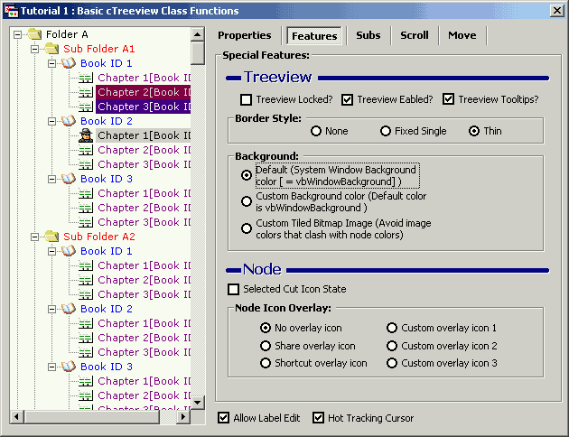



## cTreeView Class wrapper v02\.03\.00 \(\*\*Release 6 \- Animated Graphic TreeBack Demo \- UNIQUE\!\*\*\)

### Description

Added BackMode, BackColor, BackPicture, BackFileName, DisableMultiSelect, New Tutorial (Disable Multi-Node Select), updated Tutorial 1 (demonstrate new Back features) and added Animated TreeView Image Background (YES - A first! Pretty unique huh!). BackColor & BackPicture work independantly of the Nodes therefore Nodes maintain their original colors! No other VB code does this - enjoy!

Now 80+ Features!
 
### More Info
 

             |
---                |---
**Submitted On**   |
**By**             |[Slider](https://github.com/Planet-Source-Code/PSCIndex/blob/master/ByAuthor/slider.md)
**Level**          |Intermediate
**User Rating**    |4.8 (111 globes from 23 users)
**Compatibility**  |VB 6\.0
**Category**       |[Custom Controls/ Forms/  Menus](https://github.com/Planet-Source-Code/PSCIndex/blob/master/ByCategory/custom-controls-forms-menus__1-4.md)
**World**          |[Visual Basic](https://github.com/Planet-Source-Code/PSCIndex/blob/master/ByWorld/visual-basic.md)
**Archive File**   |

### Source Code

To get the code and Vote, Click <a href="http://www.planetsourcecode.com/vb/scripts/ShowCode.asp?lngWId=1&txtCodeId=37553"> here!</a>

